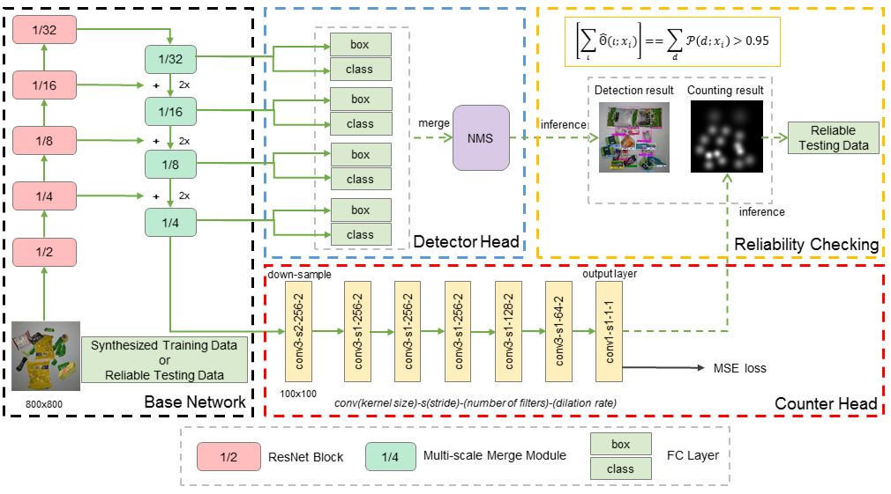

# Data Priming Network for Automatic Check-Out

Introduction
-----------------
This paper was accepted to ACM MM 2019.

This repository implements DPNet ([Data Priming Network for Automatic Check-Out](/)) using PyTorch 1.0.1 . This implementation is heavily influenced by the project [maskrcnn-benchmark](https://github.com/facebookresearch/maskrcnn-benchmark).

We propose a new data priming method
to solve the domain adaptation problem. Specifically, we first use
pre-augmentation data priming, in which we remove distracting
background from the training images using the coarse-to-fine strategy and select images with realistic view angles by the pose pruning
method. In the post-augmentation step, we train a data priming
network using detection and counting collaborative learning, and
select more reliable images from testing data to fine-tune the final
visual item tallying network.



## Installation

Check [INSTALL.md](INSTALL.md) for installation instructions.

## Inference

Run inference with pre-trained models using this command. Then images with boxes, labels and scores will
be saved to `rpc_results` folder.

```bash
python demo/rpc_demo.py --config-file configs/e2e_faster_rcnn_R_101_FPN_1x_rpc_xxx.yaml --images_dir /path/to/test2019
```

## Prepare dataset

Using `toolboxes` to extract masks, train [Salient Object Detection](https://github.com/AceCoooool/DSS-pytorch)
and render with [CycleGAN](https://github.com/junyanz/pytorch-CycleGAN-and-pix2pix). Then modify `maskrcnn_benchmark/config/paths_catalog.py` 
to make the paths correct.

The extracted masks can be download here: [Google Drive](https://drive.google.com/drive/folders/1QqPQ0l7nDpIt8SnuUYWaYQU_8e_anHFc?usp=sharing)

## Single GPU training

Most of the configuration files that we provide assume that we are running on 4 GPUs.
In order to be able to run it on fewer GPUs, there are a few possibilities:

**1. Run the following without modifications**

```bash
python tools/train_net.py --config-file "/path/to/config/file.yaml"
```
This should work out of the box and is very similar to what we should do for multi-GPU training.
But the drawback is that it will use much more GPU memory. The reason is that we set in the
configuration files a global batch size that is divided over the number of GPUs. So if we only
have a single GPU, this means that the batch size for that GPU will be 8x larger, which might lead
to out-of-memory errors.

If you have a lot of memory available, this is the easiest solution.

**2. Modify the cfg parameters**

If you experience out-of-memory errors, you can reduce the global batch size. But this means that
you'll also need to change the learning rate, the number of iterations and the learning rate schedule.

Here is an example for Mask R-CNN R-50 FPN with the 1x schedule:
```bash
python tools/train_net.py --config-file "configs/e2e_mask_rcnn_R_50_FPN_1x.yaml" SOLVER.IMS_PER_BATCH 2 SOLVER.BASE_LR 0.0025 SOLVER.MAX_ITER 720000 SOLVER.STEPS "(480000, 640000)" TEST.IMS_PER_BATCH 1
```
This follows the [scheduling rules from Detectron.](https://github.com/facebookresearch/Detectron/blob/master/configs/getting_started/tutorial_1gpu_e2e_faster_rcnn_R-50-FPN.yaml#L14-L30)
Note that we have multiplied the number of iterations by 8x (as well as the learning rate schedules),
and we have divided the learning rate by 8x.

We also changed the batch size during testing, but that is generally not necessary because testing
requires much less memory than training.


## Multi-GPU training
We use internally `torch.distributed.launch` in order to launch
multi-gpu training. This utility function from PyTorch spawns as many
Python processes as the number of GPUs we want to use, and each Python
process will only use a single GPU.

```bash
export NGPUS=4
python -m torch.distributed.launch --nproc_per_node=$NGPUS tools/train_net.py --config-file "path/to/config/file.yaml"
```
## Results


|    level |      method        |   cAcc |  mCIoU |  ACD | mCCD |  mAP50 |   mmAP |
|     ---: |               ---: |   ---: |   ---: | ---: | ---: |   ---: |   ---: |
|     easy | Syn+Render (DPNet) | 90.32% | 97.87% | 0.15 | 0.02 |  98.6% | 83.07% |
|   medium | Syn+Render (DPNet) | 80.68% | 97.38% | 0.32 | 0.03 | 98.07% | 77.25% |
|     hard | Syn+Render (DPNet) | 70.76% | 97.04% | 0.53 | 0.03 | 97.76% | 74.95% |
| averaged | Syn+Render (DPNet) | 80.51% | 97.33% | 0.34 | 0.03 | 97.91% | 77.04% |

## Citations
Please consider citing this project in your publications if it helps your research. The following is a BibTeX reference. The BibTeX entry requires the `url` LaTeX package.
```
TODO
```